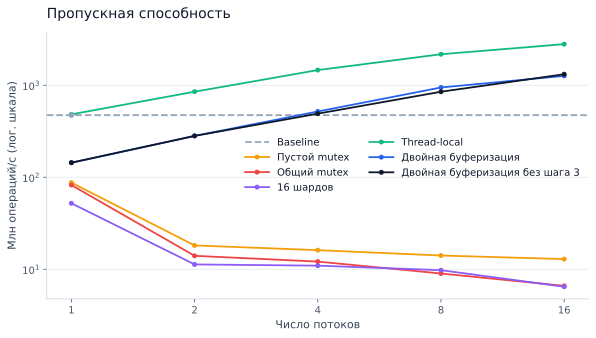
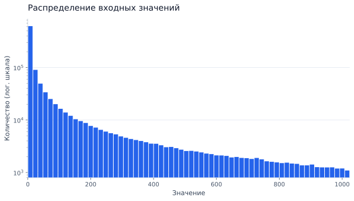

# Результаты замеров

| Реализация | 1 поток | 2 потока | 4 потока | 8 потоков | 16 потоков |
| :--- | ---: | ---: | ---: | ---: | ---: |
| Baseline | 473.185 | — | — | — | — |
| Пустой mutex | 87.501 | 18.162 | 16.138 | 14.117 | 12.907 |
| Общий mutex | 82.312 | 14.005 | 12.123 | 9.000 | 6.599 |
| 16 шардов | 52.145 | 11.295 | 10.950 | 9.774 | 6.461 |
| Thread-local | 483.215 | 851.921 | 1463.748 | 2174.935 | 2799.345 |
| Двойная буферизация | 143.940 | 281.783 | 519.322 | 946.594 | 1265.056 |
| Двойная буферизация без шага 3 | 144.143 | 281.646 | 491.868 | 850.974 | 1318.936 |

## Стресс-тест

| Реализация | Битых снимков | Меньше | Равно | Больше | Разница итогового count |
| :--- | ---: | ---: | ---: | ---: | ---: |
| 16 шардов | 94.11% | 9176 | 589 | 235 | 0 |
| Thread-local | 99.68% | 9966 | 32 | 2 | 0 |
| Двойная буферизация | 0.00% | 0 | 10000 | 0 | 0 |
| Двойная буферизация без шага 3 | 99.43% | 9943 | 57 | 0 | -6 |
